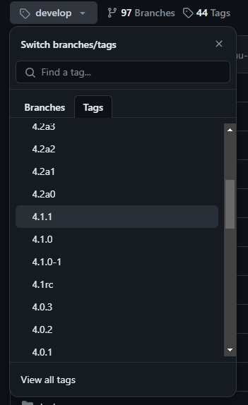
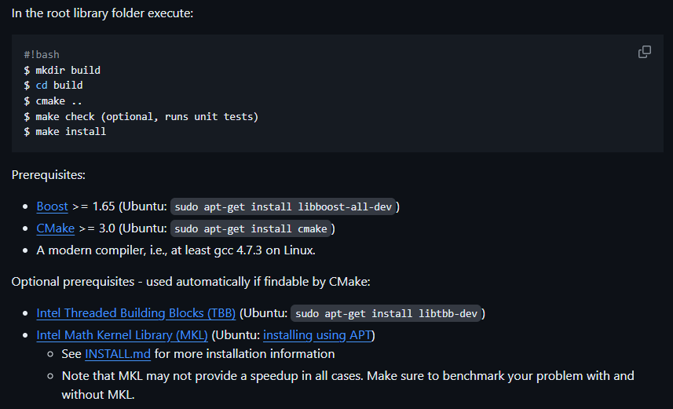

# Robustness-Comparison
Project Proposal - A Comparative Analysis on Redundancy and Robustness of Centralized and Decentralized Multi-Robot SLAM

# Swarm-SLAM installation guide

Reference from [Swarm-SLAM repo](https://github.com/MISTLab/Swarm-SLAM) and [startup guide](https://lajoiepy.github.io/cslam_documentation/html/md_startup-instructions.html)

## Install ROS2
I have Ubuntu 22.04 and ROS 2 Humble installed before. They used Foxy but Humble is also fine. Installation can be found [here](https://docs.ros.org/en/humble/Installation.html) and kindly check this youtube [link](https://www.youtube.com/watch?v=0aPbWsyENA8) or any other tutorial.

## Install repo packages
After cloning the Swarm-SLAM repo,
```
sudo apt install python3-vcstool
cd $SWARM_REPO
```

Then, edit the cslam.repos file such that it has the following contents. This is necessary to
install cslam_visualization, which isn't installed by default.
```
repositories:
  cslam:
    type: git
    url: https://github.com/lajoiepy/cslam.git
    version: main
  cslam_interfaces:
    type: git
    url: https://github.com/lajoiepy/cslam_interfaces.git
    version: main
  cslam_experiments:
    type: git
    url: https://github.com/lajoiepy/cslam_experiments.git
    version: main
  cslam_visualization:
    type: git
    url: https://github.com/lajoiepy/cslam_visualization.git
    version: main
```

From there,
```
mkdir src
vcs import src < cslam.repos
```

## Install miniconda
Check this [link](https://docs.anaconda.com/free/miniconda/). For Linux, simply
```
mkdir -p ~/miniconda3
wget https://repo.anaconda.com/miniconda/Miniconda3-latest-Linux-x86_64.sh -O ~/miniconda3/miniconda.sh
bash ~/miniconda3/miniconda.sh -b -u -p ~/miniconda3
rm -rf ~/miniconda3/miniconda.sh
```
and initialize with
```
~/miniconda3/bin/conda init bash
~/miniconda3/bin/conda init zsh
```

## Create virtual env
```
conda create --name cslam
conda activate cslam
sudo apt install python3-pip 
```
Then
```
pip install -r requirements.txt # The requirements file is in the main Swarm-SLAM repo.You don't need torch if you are only using lidar.
```
If any of the packages are **not installed**, run
```
pip install $PACKAGES
or
conda install $PACKAGES
```
Make sure you are using the `pip` in the *virtual env (not base)*

## Install gtsam
Install here: https://github.com/borglab/gtsam version 4.1.1. Instead of doing a `git clone`, I manually download the zip file of version 4.1.1 to my `\home`



Navigate to the gtsam folder and do the following. I have errors when doing `make check` but `make install` went through. 



## Install Teaser++
I found that Teaser++ can be most easily installed by running the following script
```
sudo apt install cmake libeigen3-dev libboost-all-dev
git clone https://github.com/MIT-SPARK/TEASER-plusplus.git
cd TEASER-plusplus && mkdir build && cd build
cmake .. && make
sudo make install
sudo ldconfig
cd .. && cd examples/teaser_cpp_ply && mkdir build && cd build
cmake .. && make
./teaser_cpp_ply
```
If done correctly, there should be some example output from Teaser++.

To allow Teaser++ to work with the Python in Swarm-SLAM, run the following:
```
cd TEASER-plusplus/build
cmake -DTEASERPP_PYTHON_VERSION=3.6 ..
make teaserpp_python
cd python
pip install .
```

## Install ROS2 Dependencies

```
sudo apt install python3-rosdep python3-colcon-common-extensions
source /opt/ros/$YOUR_ROS_DISTRO/setup.bash
sudo rosdep init
rosdep update
rosdep install --from-paths src -y --ignore-src --rosdistro $YOUR_ROS_DISTRO
```

## Build and test
```
conda activate cslam
source /opt/ros/foxy/setup.bash
colcon build
colcon test
```

**NOTE** The colcon build may fail with a cc1plus error on certain setups. This seems to be associated with limited memory. Running "colcon build" again seems to fix the error.

For any of the module **missing**, run
```
pip install $PACKAGES
or
conda install $PACKAGES
```
Make sure you are using the `pip` in the *virtual env (not base)*

## Preparing Datasets (Work in Progress)

To get the Graco dataset working, download from https://sites.google.com/view/graco-dataset/download. Download the ROS2Bag for Ground-01. This is a large dataset, so it make take some time. Unzip the file somewhere easy to access.

Once unzipped, create a symlink so the dataset can be accessed by Swarm-SLAM:
```
cd Swarm-SLAM/install/cslam_experiments/share/cslam_experiments/data
mkdir Graco_ground
cd Graco_ground
ln -s PATH_TO_DATASET_FOLDER Graco-0
```

In my case, I extracted the dataset to my downloads folder on Windows 11, so the symlink command became "ln -s /mnt/c/Users/(USER)/Downloads/ground-01/ground-01_0.db3 Graco-0".

## Running Experiments (Work in Progress)

The config file needs to be modified so it logs data (it does not be default: https://github.com/lajoiepy/cslam_experiments/blob/9f72df6549478e55643e5c1ae566675d14faee13/config/graco_lidar.yaml#L35)

To run experiments, first source using "source install/setup.bash" while in the swarm repo. Then, the following command should be accepted:
```
ros2 launch cslam_experiments graco_lidar.launch.py
```

In another terminal, source again and run `ros2 launch cslam_visualization visualization_lidar.launch.py` in the swarm repo.

The code does not exit on its own, so Ctrl-C once no new data is being processed.


# Collab_orb_slam2

Reference from [collab_orb_slam2](https://github.com/d-vo/collab_orb_slam2). I tested on Ubuntu 18.04 and ROS Melodic

## Building

```
sudo apt-get install libglew-dev libboost-all-dev libopencv-dev build-essential cmake cmake-gui libeigen3-dev
git clone https://github.com/d-vo/collab_orb_slam2
cd collab_orb_slam2
chmod +x build.sh
./build.sh
```
Install ROS Melodic
```
sudo sh -c 'echo "deb http://packages.ros.org/ros/ubuntu $(lsb_release -sc) main" > /etc/apt/sources.list.d/ros-latest.list'
sudo apt install curl
curl -s https://raw.githubusercontent.com/ros/rosdistro/master/ros.asc | sudo apt-key add -
sudo apt update
sudo apt install ros-melodic-desktop-full
echo "source /opt/ros/melodic/setup.bash" >> ~/.bashrc
source ~/.bashrc
source /opt/ros/melodic/setup.bash
sudo apt install python-rosdep python-rosinstall python-rosinstall-generator python-wstool build-essential
sudo apt install python-rosdep
sudo rosdep init
rosdep update
```

If you want to use ROS to run the compression make sure to have ROS installed and added the Examples/ROS path to your ROS_PACKAGE_PATH: (Make sure to chnage "YOUR_PATH_TO" with your folder)
```
export ROS_PACKAGE_PATH=${ROS_PACKAGE_PATH}:YOUR_PATH_TO/collab_orb_slam2/Examples/ROS
echo 'export ROS_PACKAGE_PATH=${ROS_PACKAGE_PATH}:YOUR_PATH_TO/collab_orb_slam2/Examples/ROS' >> ~/.bashrc 
source ~/.bashrc

chmod +x build_ros_compress.sh
./build_ros_compress.sh
```
If you get eigen3 error while installation use this 
```
sudo ln -s /usr/include/eigen3/Eigen /usr/include/Eigen
```

## Dataset
Download the KITTI odometry dataset (grayscale images) from [here](http://www.cvlibs.net/datasets/kitti/eval_odometry.php)
Two simple examples of how to run the feature compression and collaborative mapping using 1) depth coding and 2) stereo coding. Every agent has a unique identifier. The bitstream will be published as /featComp/bitstreamN, where N is the agent id. Please note that the configuration for the server is fixed in the source code for agent 0 running KITTI 00 and agent 1 running KITTI 07
```
roscore
```
### Depth
Start Server in new window
```
./Examples/ROS/compression/KittiServerDepth -v Vocabulary/voc_k10_l_5_N_100000.txt -c Vocabulary/stats_8b.vstats -s Examples/ROS/compression/
```
Start Agent, change PATH_TO_DATASET_FOLDER with your data folder, SEQUENCE_NUMBER with KITTI sequence number like 00/07 etc. AGEND_ID with 1/2/etc
```
./Examples/ROS/compression/KittiAgentDepth -v Vocabulary/voc_k10_l_5_N_100000.txt -c Vocabulary/stats_8b.vstats -i PATH_TO_DATASET_FOLDER/dataset/sequences/SEQUENCE_NUMBER -r AGEND_ID -s  Examples/ROS/compression/KITTIX.yaml
```
### stereo
Start Server in new window
```
./Examples/ROS/compression/KittiServerStereo -v Vocabulary/voc_k10_l_5_N_100000.txt -c Vocabulary/stats_8b.vstats -s Examples/ROS/compression/
```
Start Agent, change PATH_TO_DATASET_FOLDER with your data folder, SEQUENCE_NUMBER with KITTI sequence number like 00/07 etc. AGEND_ID with 1/2/etc
```
./Examples/ROS/compression/KittiAgentStereo -v Vocabulary/voc_k10_l_5_N_100000.txt -c Vocabulary/stats_8b.vstats -i PATH_TO_DATASET_FOLDER/dataset/sequences/SEQUENCE_NUMBER -r AGEND_ID -s  Examples/ROS/compression/KITTIX.yaml
```
Remember to start server first before starting the agent


